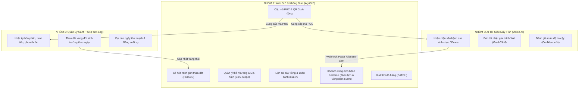

# 📑 BẢN ĐẶC TẢ HỢP ĐỒNG TÍCH HỢP HỆ THỐNG LIÊN NHÓM (CROSS-GROUP INTEGRATION CONTRACT)

> **Dự án:** Hệ Thống Quản Lý Nông Nghiệp Thông Minh & Giám Sát Vùng Trồng Đà Lạt (Agri XAI Ecosystem)  
> **Định danh dùng chung cốt lõi:** Mã Vùng Trồng chuẩn Quốc gia **`PUC` (Production Unit Code)** theo TCCS 774/BNN-BVTV.

---

## 🏛️ 1. PHÂN CÔNG PHẠM VI 3 PHÂN HỆ (3 NHÓM ĐỒ ÁN)



---

## 🔌 2. API CONTRACT MATRIX (GIAO DIỆN TÍCH HỢP)

### 2.1. Webhook Cảnh báo Dịch bệnh từ Nhóm 3 (AI Vision) ➔ Nhóm 1 (Web GIS)
* **Endpoint:** `POST /api/v1/gis/plots/disease-alert`
* **Header:** `x-api-key: <GIS_API_SECRET_KEY>`, `Content-Type: application/json`
* **Request Payload:**
```json
{
  "puc": "VN-LD-2026-000003",
  "disease_name": "Bệnh Rỉ Sắt Cà Phê (Hemileia vastatrix)",
  "confidence": 0.94,
  "xai_overlay_url": "https://cdn.agrigis.vn/xai/VNLD003-rust-gradcam.png",
  "risk_level": 2
}
```
* **Phản hồi từ Web GIS:**
```json
{
  "code": "SUCCESS",
  "message": "Đã ghi nhận cảnh báo dịch bệnh và khoanh vùng đệm tự động.",
  "data": {
    "epicenter_puc": "VN-LD-2026-000003",
    "risk_level": 2,
    "buffer_radius_meters": 500,
    "affected_neighbors": [
      { "puc": "VN-LD-2026-000005", "risk_level": 1 }
    ]
  }
}
```

---

### 2.2. API Lấy Lịch Sử Cây Trồng & Thổ Nhưỡng từ Nhóm 1 (Web GIS) ➔ Nhóm 2 (Canh Tác)
* **Endpoint:** `GET /api/v1/gis/plots/{puc}`
* **Response Payload (Mục Thổ nhưỡng & Lịch sử mùa vụ):**
```json
{
  "code": "SUCCESS",
  "data": {
    "puc": "VN-LD-2026-000003",
    "plot_name": "Lô Cà Phê Arabica Cầu Đất C1",
    "crop_type": "Cà phê Arabica",
    "soil_type": "Đất đỏ Bazan màu mỡ",
    "soil_ph": 5.8,
    "soil_moisture": 74,
    "soil_organic_matter": "Mùn hữu cơ cao (4.2%)",
    "elevation_m": 1540,
    "slope_deg": 16.5,
    "crop_history": [
      {
        "season_name": "Vụ Mùa Hiện Tại 2026",
        "crop_type": "Cà phê Arabica Cầu Đất",
        "start_date": "2026-01-10",
        "end_date": null,
        "yield_amount": 4500,
        "yield_unit": "kg",
        "soil_condition_note": "Bổ sung 2 tấn phân trùn quế vi sinh, pH ổn định 5.8",
        "disease_history": "Rỉ sắt nhẹ đầu vụ đã xử lý Trichoderma",
        "is_current": true
      },
      {
        "season_name": "Vụ Luân Canh Phủ Đất 2025",
        "crop_type": "Đậu cô ve leo & Cỏ Vetiver chống xói mòn",
        "start_date": "2025-05-15",
        "end_date": "2025-11-20",
        "yield_amount": 2100,
        "yield_unit": "kg",
        "soil_condition_note": "Tăng cường cố định đạm sinh học tự nhiên",
        "disease_history": "Không có dịch bệnh",
        "is_current": false
      }
    ]
  }
}
```

---

### 2.3. API Ghi Nhận Mùa Vụ / Đổi Cây Trồng từ Nhóm 2 (Canh Tác) ➔ Nhóm 1 (Web GIS)
* **Endpoint:** `POST /api/v1/gis/plots/{puc}/crop-history`
* **Request Payload:**
```json
{
  "season_name": "Vụ Thu Đông 2026",
  "crop_type": "Bắp cải tím Đà Lạt",
  "start_date": "2026-09-01",
  "yield_amount": 3500,
  "yield_unit": "kg",
  "soil_condition_note": "Đất đã nghỉ canh 30 ngày, bón lót phân hữu cơ vi sinh",
  "disease_history": "Không có",
  "is_current": true
}
```

---

## 🎯 3. NGUYÊN TẮC PHỐI HỢP & BẢO TOÀN DỮ LIỆU
1. **Không trùng lặp trách nhiệm:** Web GIS không làm thay form nhật ký bón phân chi tiết theo giờ của Nhóm 2; Nhóm 2 không tự vẽ lại bản đồ GIS hay tính toán không gian PostGIS.
2. **Khóa liên kết `PUC`:** Mọi bản ghi nhật ký canh tác (Nhóm 2) và kết quả chẩn đoán bệnh AI (Nhóm 3) bắt buộc phải đính kèm trường `puc`.
3. **Tra cứu đa kênh:** Người tiêu dùng quét QR có thể xem được chuỗi giá trị khép kín từ **Vị trí thửa đất (Nhóm 1)** ➔ **Quy trình chăm sóc (Nhóm 2)** ➔ **Lịch sử an toàn sâu bệnh (Nhóm 3)** ➔ **Lô hàng xuất xưởng (Nhóm 1)**.
